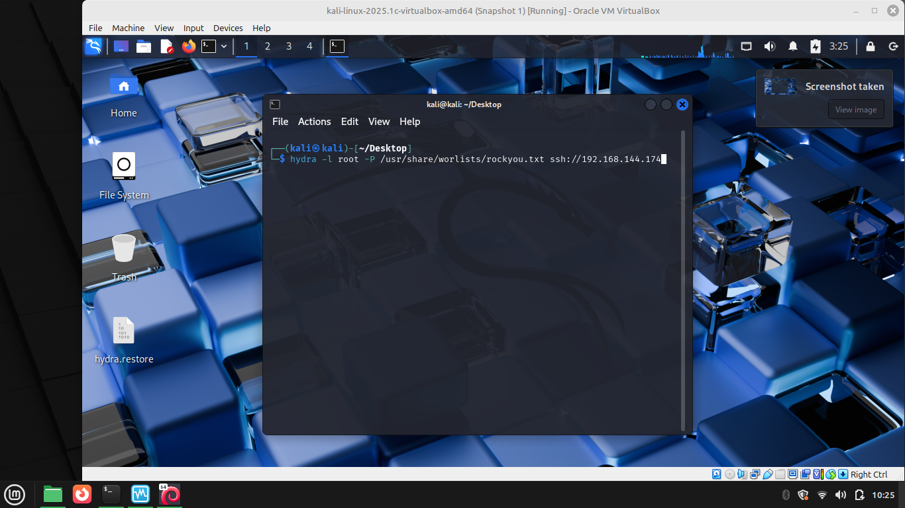
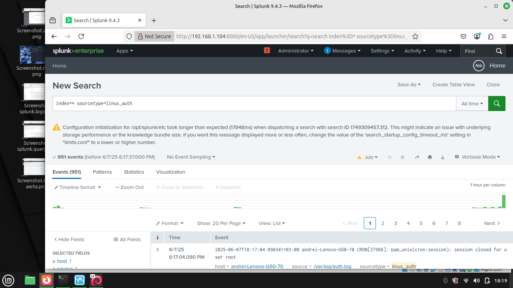
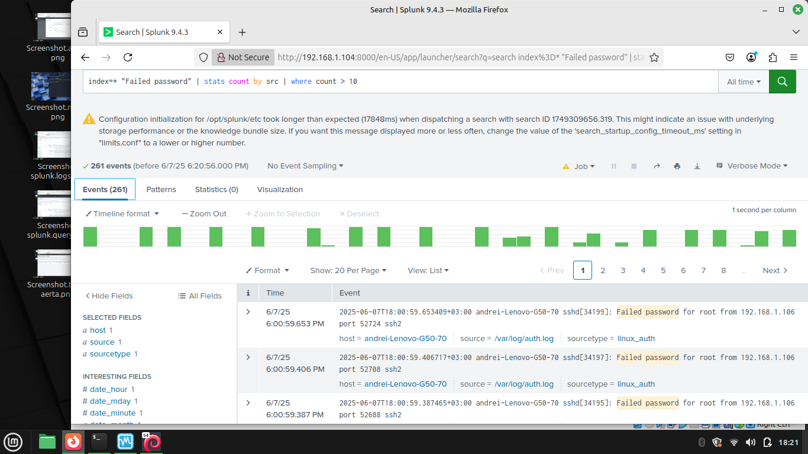
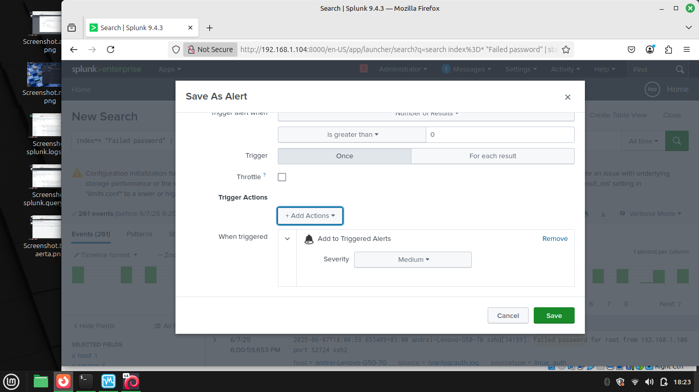
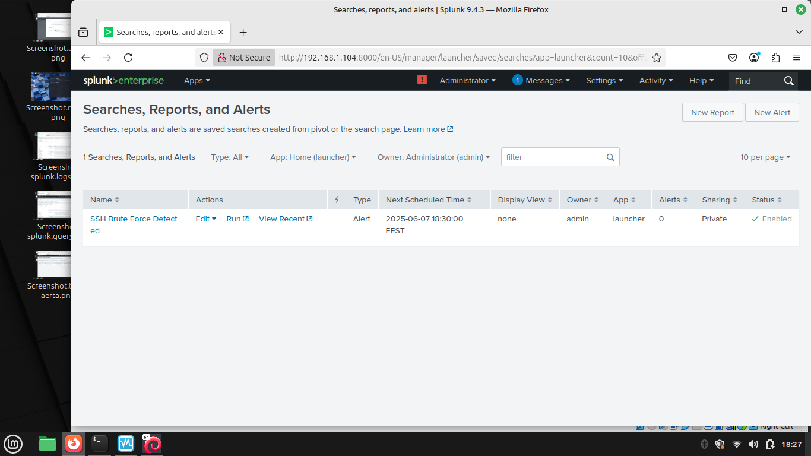

# SSH-BruteForce-Detection:
-proiect pentru simularea si detectarea unui atac de tip brute-force SSH
# In acest proiect am folosit:
-Kali Linux VM pentru a genera atacul

-Linux Mint, host

-Splunk free
# Pasii realizati:
1. Pe host, am activat logurile de firewall si server SSH (sudo ufw enable, sudo ufw logging on, sudo systemctl enable ssh)
2. Din Kali VM, am simulat un atac brute-force folosind Hydra (hydra -l root -P /usr/share/wordlists/rockyou.txt ssh://)
3. Am importat logurile in Splunk (Data inputs - Files & Directories)
4. Am creat un query pentru a cauta IP urile care au avut peste 10 incercari esuate
5. Am creat o alerta in Splunk
# Screenshots:
Capturile de ecran ale proiectului:

